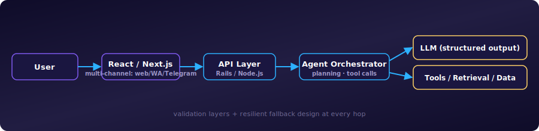

<div align="center">


<br/>

[](https://your-portfolio-website.com)
[](https://www.linkedin.com/in/zulqarnain-nazir/)
[](https://www.upwork.com/freelancers/zulqarnainnazir)
[](mailto:zulqaranin.dev@gmail.com)

<br/>

<i>I help startups rescue legacy systems and ship production-grade SaaS & AI platforms — architecture that survives contact with real users, not just the demo.</i>

</div>

<br/>

```bash
$ whoami
> Principal Full Stack Software Engineer, Lahore PK
> 12+ years shipping enterprise SaaS, AI/LLM & cloud-native systems
> Currently: Revivo Technology + Full Stack Architect on Upwork
> Stack: Node.js · React/Next.js · Ruby on Rails · Python · AWS · PostgreSQL
> Status: Open to full-time & consulting engagements
```

<div align="center">


</div>

---

### 🧭 Currently

- 🔭 **Principal Full Stack Software Engineer** @ **Revivo Technology** — architecting enterprise SaaS, AI & healthcare platforms
- 💼 **Full Stack Architect & Technical Consultant** on **Upwork** — 30+ shipped SaaS / AI / FinTech / Healthcare products, Top 3% worldwide
- 🎓 MPhil, Machine Learning & Data Science — PUCIT
- 🌱 Deepening AI/LLM orchestration & production-grade agent systems
- 🌍 Lahore, Pakistan — working across US / EU / EMEA time zones

---

### 🏆 Selected Results

- ✔ Architected enterprise healthcare platforms handling real clinical workflows, built to **HIPAA / HL7-FHIR** standards
- ✔ Built and shipped **CoBrokerAI** solo end-to-end — an agentic AI platform for commercial real estate, live in production
- ✔ Modernized legacy Rails applications into scalable systems — cutting technical debt for long-term velocity
- ✔ Delivered **30+ production systems** (SaaS, AI, FinTech, Healthcare) for clients across the US, EU & Middle East
- ✔ **5,200+ hours, 100% Job Success, Top Rated Plus** — Top 3% on Upwork
- ✔ Led engineering teams through architecture reviews, code review culture & hands-on mentoring

---

### 🎯 Specialisations

<table>
<tr>
<th align="left">Domain</th>
<th align="left">What I Build</th>
<th align="left">Stack</th>
<th align="left">Standards</th>
</tr>
<tr>
<td>🏥 <b>Healthcare</b></td>
<td>Clinical workflow systems, patient-facing modules, secure data handling</td>
<td>Rails · React · PostgreSQL · AWS</td>
<td>HIPAA, HL7/FHIR</td>
</tr>
<tr>
<td>💳 <b>FinTech</b></td>
<td>Mortgage & lending platforms, banking API integrations, financial dashboards</td>
<td>Rails · PostgreSQL · REST</td>
<td>PCI-DSS, GDPR</td>
</tr>
<tr>
<td>🏢 <b>Enterprise SaaS</b></td>
<td>Multi-tenant platforms, architecture strategy, technical leadership</td>
<td>Node.js · React · Next.js · PostgreSQL</td>
<td>SOC2-ready patterns</td>
</tr>
<tr>
<td>🤖 <b>AI / LLM Automation</b></td>
<td>Production LLM integrations, structured outputs, agent orchestration</td>
<td>OpenAI · Python · Node.js</td>
<td>Validation layers, resilient fallback design</td>
</tr>
<tr>
<td>🏘 <b>Real Estate / Marketplace</b></td>
<td>Data intelligence platforms, real-time analytics</td>
<td>React · Rails · AWS · Docker</td>
<td>Query & infra optimization for scale</td>
</tr>
</table>

---

### 🤖 AI & Agentic Engineering

I design and ship **production AI systems**, not prototypes — agents that call tools, cite sources, and hold up under real usage:

- **Agent orchestration** — multi-step planning, tool-calling, structured outputs with validation & resilient fallback design
- **RAG & retrieval pipelines** — grounding LLM outputs in real data instead of hallucinated answers
- **Multi-channel agent delivery** — chat interfaces accessible via web, WhatsApp, Telegram & email
- **Production hardening** — rate limits, error handling, observability, and graceful degradation for AI features that ship, not just demo

<div align="center">

</div>

<table>
<tr><th align="left">🏗 Flagship: CoBrokerAI</th></tr>
<tr><td>

An **agentic AI platform for commercial real estate** — <a href="https://www.cobroker.ai/">cobroker.ai</a> — built solo, end-to-end, as sole senior developer.

The agent plans multi-step research (trade area analysis, brand-fit scoring, site-selection questions), calls tools to gather data, and traces its own work back to sources — accessible via web, Telegram, WhatsApp & email.

`Ruby on Rails` `Node.js` `React` `Next.js` `LLM / Agent Orchestration`

</td></tr>
</table>

---

### 🛠 Tech Stack

<div align="center">

**Languages**
<br/>


**Frameworks & Frontend**
<br/>


**Databases & Cloud**
<br/>


**Tools & Practices**
<br/>


</div>

---

### 💼 Experience

<details open>
<summary><b>Principal Full Stack Software Engineer</b> — Revivo Technology <i>(2025 – Present)</i></summary>
<br/>

- Lead architecture & development of enterprise SaaS, AI, and healthcare platforms
- Drive engineering excellence through architecture reviews, coding standards & mentoring
- Deliver production LLM integrations with structured outputs, validation & fallback layers
</details>

<details>
<summary><b>Full Stack Architect & Technical Consultant</b> — Upwork <i>(2020 – Present)</i></summary>
<br/>

- Delivered 30+ enterprise SaaS, AI, FinTech, Healthcare, Marketplace & Real Estate applications
- Top Rated Plus (Top 3% worldwide) · 100% Job Success · 5,200+ hours · 34 contracts
</details>

<details>
<summary><b>Senior Software Engineer</b> — D3velopers <i>(2021 – 2024)</i></summary>
<br/>

- Built and optimized REST APIs for enterprise React applications
- Improved backend performance through query optimization and database redesign
</details>

<details>
<summary><b>Senior Ruby on Rails Developer</b> — Kinship, USA <i>(2022 – 2023)</i></summary>
<br/>

- Designed REST & GraphQL APIs powering nationwide reporting systems (Shelter Animals Count / ASPCA)
</details>

<details>
<summary><b>Full Stack Software Engineer</b> — Analytico Technologies <i>(2016 – 2021)</i></summary>
<br/>

- Built enterprise SaaS applications across Node.js, React, Rails, MongoDB & PostgreSQL
- Applied TDD/BDD methodologies within Agile Scrum teams
</details>

---

### 🚀 Notable Projects

<table>
<tr><th align="left">Project</th><th align="left">Description</th><th align="left">Tech</th></tr>
<tr><td><b>🤖 CoBrokerAI</b></td><td><a href="https://www.cobroker.ai/">cobroker.ai</a> — agentic AI platform for commercial real estate, built solo end-to-end</td><td>Rails · Node.js · React · LLM Agents</td></tr>
<tr><td><b>BlueBird</b></td><td>Enterprise healthcare information system</td><td>Rails · React · PostgreSQL · AWS</td></tr>
<tr><td><b>Flyer</b></td><td>Real estate data intelligence SaaS, real-time analytics</td><td>React · Rails · AWS · Docker</td></tr>
<tr><td><b>LoanLink24</b></td><td>Multi-bank mortgage comparison platform</td><td>Rails · PostgreSQL · React</td></tr>
<tr><td><b>TENNA</b></td><td>Construction asset & fleet management platform</td><td>Rails · React · PostgreSQL · AWS</td></tr>
<tr><td><b>Shelter Animals Count</b></td><td>Nationwide reporting system (Kinship / ASPCA)</td><td>Rails · MySQL · GraphQL</td></tr>
</table>

---

### 📊 GitHub Stats

<div align="center">


</div>

---

### 🤝 Let's Work Together

> 12+ years turning ambiguous product ideas into production systems that handle real users, real data, and real revenue — without the rewrite six months later.

**Why teams bring me in:**
- 🏗 **I stay involved from architecture through production** — designing systems, reviewing code, solving incidents, and helping teams deliver reliably
- 🎯 **12+ years across the full stack** — I ramp on unfamiliar stacks fast and don't over-engineer
- 🧭 **I mentor as I build** — code reviews and architecture docs that make the team faster, not just the codebase

Open to **full-time roles, contract work, and technical consulting** — architecture reviews, technical leadership, AI/LLM integration, and full-stack delivery from MVP to production scale.

<div align="center">

[](https://www.upwork.com/freelancers/zulqarnainnazir)
[](mailto:zulqaranin.dev@gmail.com)
[](https://www.linkedin.com/in/zulqarnain-nazir/)

<br/>


</div>


